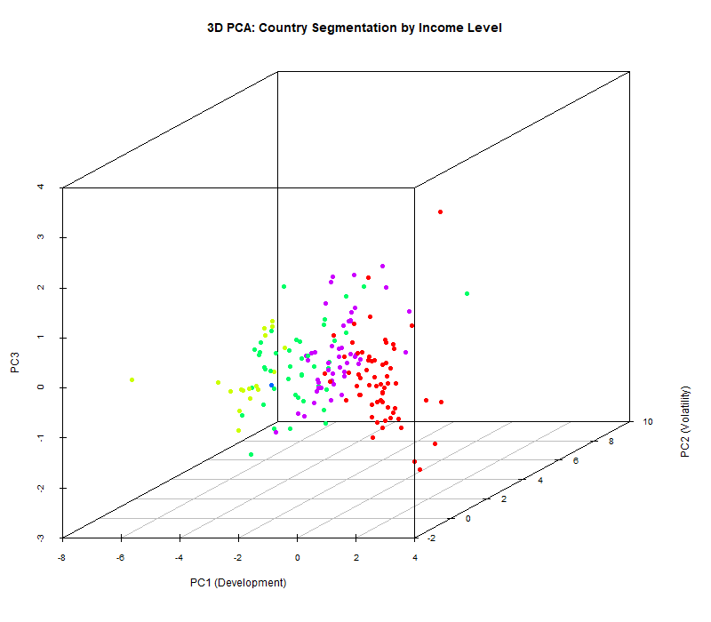
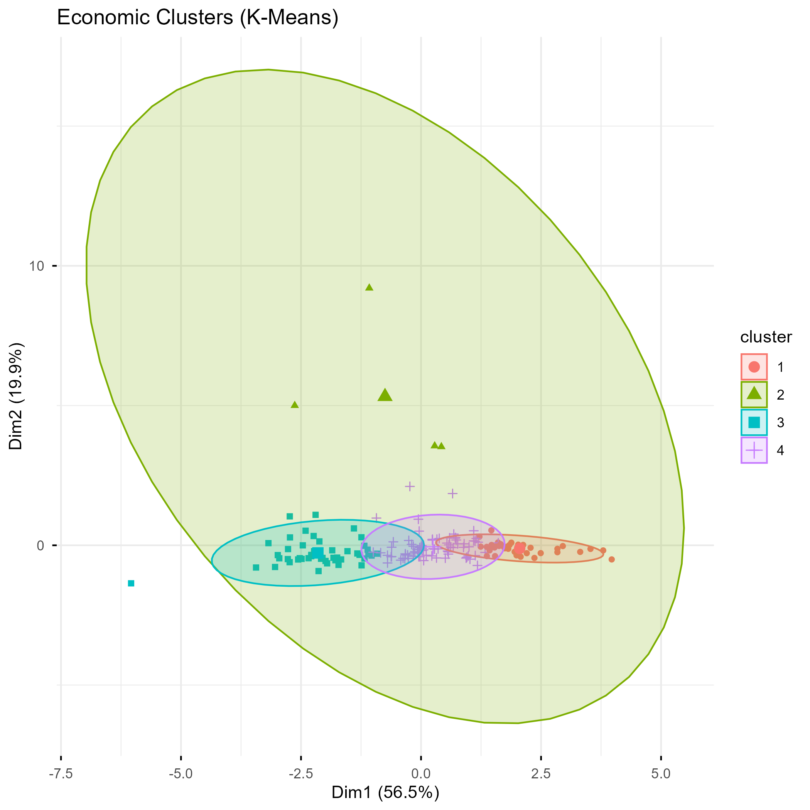

# Income Segmentation in R: World Economies


R workflow that pulls live data directly from the World Bank API (via the WDI package) and segments world economies by income level using PCA and K-Means, without touching the income labels during training.

---

## Project Overview

The pipeline runs in 3 steps after setting parameters in `config.R`:

- **Setup:** fetches World Bank indicators (GDP per capita, internet users, mobile subscriptions, life expectancy, inflation), cleans and standardises the data, runs KMO and Bartlett adequacy tests (KMO = 0.79, Bartlett p < 0.001).
- **PCA:** manual eigen-decomposition, scree plot, distribution analysis for key indicators, and a 3D scatter coloured by real income group.
- **K-Means:** elbow method to confirm `k = 4`, cluster visualisation, GDP boxplot by cluster, and a purity heatmap cross-tabulating clusters vs real income levels.

---

## File Structure

```
income-segmentation-r/
│
├── visualization/
│   ├── pca_viz/
│   └── kmeans_viz/
├── workspaceData/
├── .gitignore
├── 00_setup.R            # API pull, cleaning, KMO/Bartlett, scaling
├── 01_pca.R              # PCA: eigen-decomposition, scree plot, 3D scatter
├── 02_kmeans.R           # K-Means: elbow, clusters, boxplot, purity heatmap
├── config.R              # Parameters and paths: start here
├── LICENSE
└── README.md
```

---

## PCA results

Applied on standardised indicators (mean 0, variance 1).

| Component | Variance | Cumulative |
|-----------|----------|------------|
| PC1 | 56.55% | 56.55% |
| PC2 | 19.88% | 76.42% |
| PC3 | 12.24% | 88.67% |

PC1 captures the development axis, with high loadings on GDP per capita, life expectancy and internet access. PC2 reflects economic volatility, driven mainly by inflation. Three components explain 88.67% of total variance, and the 3D scatter shows visible separation between income groups before any clustering is applied.


---

## K-Means results

`k = 4`, confirmed by the elbow method, coherent with the World Bank's four income classifications.

**Centroid summary:**

| Cluster | GDP per capita | Life expectancy | Inflation |
|---------|---------------|-----------------|-----------|
| 1 | $72,471 | 81.4 | 6.7% |
| 2 | $21,765 | 73.4 | 105.2% |
| 3 | $4,730 | 63.7 | 11.1% |
| 4 | $22,369 | 73.9 | 10.2% |

Cluster 1 captures high-income economies, Cluster 3 groups the poorest countries by GDP and life expectancy. Clusters 2 and 4 sit in the middle and overlap, mainly split by inflation rather than overall development.



**Cluster quality metrics:**

| Metric | Value |
|--------|-------|
| Silhouette | 0.35 |
| Calinski-Harabasz | 98.43 |
| Davies-Bouldin | 0.91 |
| NMI | 0.45 |

The metrics show moderate segmentation. A Silhouette of 0.35 and NMI of 0.45 mean K-Means picks up real income structure but the boundaries between groups are blurry. Calinski-Harabasz of 98.43 and Davies-Bouldin of 0.91 are solid for this kind of data, the overlap in the middle clusters makes sense since income is a spectrum, not four clean buckets.

---

## How to Run

```r
install.packages(c("dplyr", "psych", "moments", "factoextra",
                   "scatterplot3d", "ggplot2", "reshape2", "WDI", "clusterCrit", "aricode"))
```

```r
source("config.R")     # set parameters
source("00_setup.R")   # fetch and prepare data
source("01_pca.R")     # PCA analysis
source("02_kmeans.R")  # clustering
```

No dataset download required, data is pulled automatically from the World Bank API.

---

## Dataset

- **Source:** World Bank Development Indicators via `WDI` R package
- **Year:** 2022
- **Variables:** GDP per capita (PPP), internet users (%), mobile subscriptions, life expectancy, inflation (CPI)
- **Coverage:** 169 countries after cleaning

## License

MIT License
